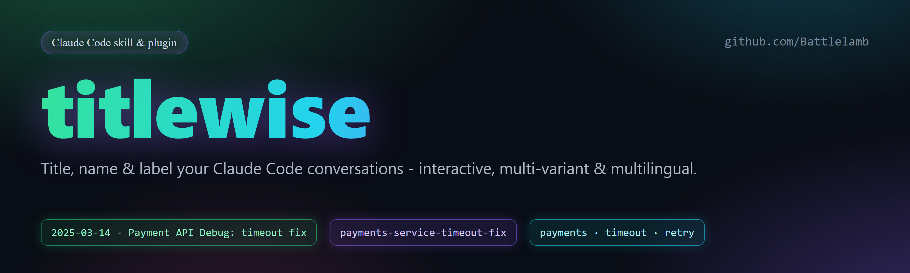
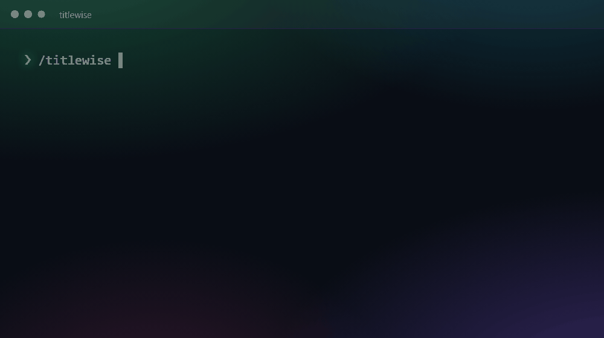

<div align="center">



**Herhangi bir [Claude Code](https://code.claude.com) konuşmasını, sonradan gerçekten bulabileceğin bir başlığa dönüştüren bir skill.**

[](https://github.com/Battlelamb/claude-code-conversation-titler/releases)
&nbsp;[](https://github.com/Battlelamb/claude-code-conversation-titler/stargazers)
&nbsp;[](LICENSE)
&nbsp;[](https://code.claude.com)
&nbsp;[](https://github.com/Battlelamb/claude-code-conversation-titler/pulls)

<br>



<sub>[English](README.md) · **Türkçe** · [中文](README.zh.md)</sub>

</div>

---

## Genel Bakış

**titlewise**, mevcut konuşmanı okuyup temiz, iyi yapılandırılmış **başlıklar** öneren interaktif bir Claude Code skill'idir - uzun ya da kısa, tarihli ya da tarihsiz, kendi dilinde, İngilizce veya Çince - ve yanında kısa bir açıklama ile arama etiketleri. Beğendiğini seçip konuşma başlığı yaparsın.

Bir Claude Code için **konuşma başlığı üreteci** gibi düşün: herhangi bir sohbeti saniyeler içinde adlandır, başlıkla veya etiketle; geçmiş konuşmalar sonradan kolay bulunsun.

**Yalnızca öneri**: önerir, sen uygularsın. Oturumuna veya transkriptine asla dokunmaz.

## Özellikler

| | |
|---|---|
| 🎛️ **İnteraktif** | Üretmeden önce başlığı nasıl istediğini sorar (dil, uzunluk, tarih, stil) |
| 🌍 **Çok dilli** | Konuşmanın dili (otomatik algılanır), İngilizce veya Çince - bir ya da birkaçı |
| 📏 **13+ varyant** | Uzun / orta / kısa, tarihli / tarihsiz, slug, anahtar-kelime, köşeli, ay, sonuç, emoji |
| 📝 **Sadece başlık değil** | Ayrıca tek paragraflık özet ve arama-dostu etiketler döndürür |
| 🔒 **Tasarımdan güvenli** | Salt-okuma; başlık önerir, oturuma asla dokunmaz |
| ⚡ **Sıfır konfigürasyon** | Tek, kendine yeten `SKILL.md`, bağımlılık yok |

## Çözdüğü sorun

Otomatik üretilen konuşma başlıkları geneldir (örneğin *"Credential information request"*) ve haftalar sonra taranması zordur. **titlewise**, oturumun asıl işini doğal olarak arayacağın bir başlığa dönüştürür - ve seçmen için bir düzine format sunar.

## Kurulum

### Plugin olarak (önerilen)

```text
/plugin marketplace add Battlelamb/claude-code-conversation-titler
/plugin install titlewise@titlewise
```

Sonradan güncelle: `/plugin marketplace update titlewise`.

### Bağımsız skill olarak

Skill klasörünü kişisel skill dizinine kopyala:

```text
plugins/titlewise/skills/titlewise/  ->  ~/.claude/skills/titlewise/
```

## Kullanım

Çağır, dört kısa soruyu yanıtla:

```text
/titlewise
```

Ya da doğal dilde tetikle - *"başlık öner"*, *"konuşmaya isim ver"*, *"name this chat"*.

**Soruları atla** - tercihini satır içinde ver:

```text
/titlewise kısa ingilizce slug
```

## Örnek

Uçtan uca tam bir çalışma.

### 1. Çağırırsın

```text
/titlewise
```

### 2. Başlığı nasıl istediğini sorar

Tek soru, uygun yerlerde çoklu seçim:

| Soru | Seçenekler |
|---|---|
| **Dil** | Kendi dilin (oto) · İngilizce · Çince |
| **Uzunluk** | Uzun · Orta · Kısa |
| **Tarih** | Önek · Sonek · Yok · Ay |
| **Stil** | Açıklayıcı · Slug · Anahtar-kelime · Sonuç · Emoji |

### 3. Varyantları önerir

Burada, bir ödeme zaman aşımı hatasını düzelten bir oturum için:

**Uzunluk x tarih**

| Varyant | Başlık |
|---|---|
| Uzun + tarihli | `2025-03-14 - Payment API Debug (payments-service): timeout fix + retry logic + integration tests` |
| Uzun | `Payment API Debug (payments-service): timeout fix + retry logic + integration tests` |
| Orta + tarihli | `2025-03-14 - Payment API Debug (payments-service): timeout fix + retries` |
| Orta | `Payment API Debug (payments-service): timeout fix + retries` |
| Kısa + tarihli | `2025-03-14 - payment timeout fix` |
| Kısa | `payment timeout fix` |

**Kompakt / arama-dostu**

| Varyant | Başlık |
|---|---|
| Slug | `payments-service-timeout-fix-2025-03-14` |
| Anahtar-kelime | `payments-service · timeout · retry · integration-tests` |
| Köşeli | `[2025-03-14][payments-service] timeout fix + retry logic` |
| Tarih-sonek | `Payment API Debug (payments-service) - 2025-03-14` |
| Ay | `2025-03 - payments-service timeout fix` |

**Stil**

| Varyant | Başlık |
|---|---|
| Sonuç-odaklı | `2025-03-14 - payments-service stabilized: timeout fix + retry logic` |
| Emoji + kısa | `🐛 payments timeout fix (2025-03-14)` |

### 4. Ayrıca açıklama ve etiketler

> **Açıklama** - payments servisindeki bir istek zaman aşımı hatası, üstel geri çekilmeli sınırlı yeniden denemeler eklenerek düzeltildi; ardından bu yol entegrasyon testleriyle kapsandı. Değişiklik istemci katmanıyla sınırlı ve mevcut timeout konfigürasyonunun arkasında devreye giriyor.
>
> **Etiketler** - `2025-03-14, payments-service, timeout, retry, backoff, integration-tests, bugfix`

Beğendiğin varyantı kopyala ve konuşma başlığı olarak ayarla.

## Nasıl çalışır

1. Mevcut konuşmayı context'ten **okur**.
2. *Dil / uzunluk / tarih / stil* için bir kez **sorar** - satır içinde vermediysen.
3. Uygun başlık varyantlarını, açıklama ve etiketlerle birlikte **üretir**.
4. Her şeyi kopyalanmaya hazır **sunar**. Sen birini seçip uygularsın - skill oturuma asla dokunmaz.

> **Başlığı neden otomatik uygulamıyor?** Konuşma başlığını uygulama kendisi yönetir ve otomatik olarak yeniden üretir; bu yüzden bir skill onu güvenilir biçimde ayarlayamaz ve canlı transkripti düzenlemek risklidir. **titlewise** öneride durur - temiz ve zarar vermez.

## Dil desteği

Başlıklar konuşmanın kendi dilinde (otomatik algılanır), **İngilizce** veya **Çince** üretilir - bir ya da birkaçı aynı anda.

## Katkı

Issue ve pull request'ler memnuniyetle karşılanır. Lütfen skill'i kendine yeten (tek `SKILL.md`) ve kişisel/ortama özel içerikten arınmış tut.

## Lisans

[MIT Lisansı](LICENSE) ile yayınlanmıştır.
